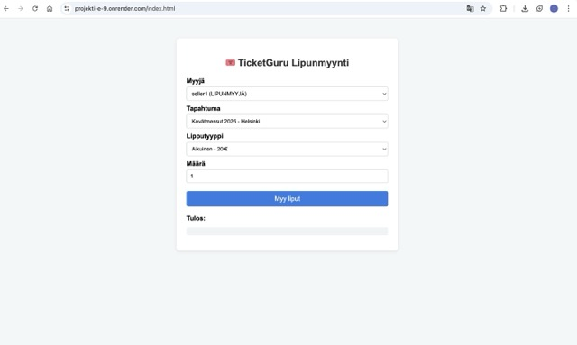

# Projektin nimi TicketGuru

Tiimi: Aitanova Azaliia, Karppinen-van Drongelen Riikka, Kumar Tejinder, Nguyen Khoa, Paajaste Maximus, Regnér Joel

## Johdanto

Tässä projektissa toteutetaan lipunmyyntijärjestelmä nimeltä TicketGuru. Järjestelmän asiakas on lipputoimisto, joka myy lippuja erilaisiin tapahtumiin fyysisessä myyntipisteessään. Järjestelmä on tarkoitettu lipunmyyjien käyttöön sekä tapahtumien ovella tapahtuvaan lipuntarkastukseen.

TicketGuru-järjestelmän avulla lipputoimisto voi määritellä järjestelmään myytävät tapahtumat ja hallita niihin liittyvää lipunmyyntiä. Lipunmyyjä myy lippuja järjestelmän kautta ja tulostaa ne asiakkaalle myyntipisteessä. Ennakkomyynnin päätyttyä jäljelle jääneet liput voidaan tulostaa ovella myytäviksi. Jokaisessa lipussa on yksilöllinen ja helposti tarkastettava koodi, jonka avulla lippu voidaan tapahtuman ovella merkitä käytetyksi ja estää väärinkäyttö.

Projektin ensisijainen käyttäjä on lipunmyyjä, ja järjestelmä on suunniteltu sujuvaan ja nopeaan käyttöön myyntitilanteessa. Järjestelmän jatkokehityksenä on tarkoitus toteuttaa verkkokauppa, jonka kautta loppuasiakkaat voivat ostaa lippuja itse, mutta tämä ominaisuus ei kuulu projektin nykyiseen toteutukseen.

### Toteutus- ja toimintaympäristö

TicketGuru toteutetaan selainpohjaisena sovelluksena. Palvelinpuolen toteutus tehdään Java Spring Boot -kehystä käyttäen. Palvelin tarjoaa järjestelmän toiminnot REST-rajapinnan kautta ja vastaa sovelluksen liiketoimintalogiikasta, lipunmyyntiin liittyvistä toiminnoista sekä tiedon käsittelystä ja tallennuksesta. Järjestelmä käyttää tietokantaa tapahtumien, lippujen ja myyntitietojen tallentamiseen.

Käyttöliittymä toteutetaan web-teknologioilla, ja sitä käytetään ensisijaisesti lipunmyyntipisteen työasemalla, kuten pöytäkoneella tai kannettavalla tietokoneella. Järjestelmä tukee myös lipuntarkastusta tapahtuman ovella, jossa lipuissa olevat koodit tarkastetaan ja merkitään käytetyiksi.

Projektin päättyessä valmiina on toimiva lipunmyyntijärjestelmä, jolla voidaan:

- Määritellä ja hallita tapahtumia
- Myydä ja tulostaa lippuja
- Tarkastaa ja merkitä liput käytetyiksi tapahtuman ovella

## Järjestelmän määrittely

Vaatimukset
 * Käyttäjien kirjaaminen järjestelmään
 * Tapahtumien ja lipputyyppien hallinta
 * Lippujen myynti ja tulostus
 * Lipuille yksilöllisen koodin luonti
 * Lipun tarkistus ja käytetyksi merkkaus
 * Tietokantaan tallentaminen

## Käyttäjäryhmät (roolit)

Lipunmyyjä
* Myy lippuja asiakkaille myyntipisteessä
* Tulostaa liput
* Näkee tapahtumien lipputilanteen

Ovitarkastaja
* Tarkistaa lipun koodin
* Merkitsee lipun käytetyksi
* Näkee lipun voimassaolon

Ylläpitäjä (Admin)
* Luo ja hallinnoi tapahtumia
* Määrittää lipputyypit ja hinnat
* Hallitsee käyttäjiä
* Tarkastelee myyntitietoja

## Käyttäjätarinat
Lipunmyyjä
* Lipunmyyjänä haluan myydä lipun asiakkaalle, jotta asiakas pääsee tapahtumaan.
* Lipunmyyjänä haluan tulostaa lipun, jotta asiakas saa fyysisen lipun.
* Lipunmyyjänä haluan nähdä jäljellä olevat liput, jotta voin seurata myyntitilannetta.

Ovitarkastaja
* Ovitarkastajana haluan skannata lipun koodin, jotta voin tarkistaa lipun aitouden.
* Ovitarkastajana haluan merkitä lipun käytetyksi, jotta samaa lippua ei voi käyttää uudelleen.

Ylläpitäjä
* Adminina haluan luoda tapahtumia, jotta lippuja voidaan myydä eri tapahtumiin.
* Adminina haluan määrittää lipun hinnat, jotta myynti voidaan hinnoitella oikein.


## Käyttöliittymä
Järjestelmä on selainpohjainen ja sitä käytetään ensisijaisesti myyntipisteen työasemalla. Käyttöliittymä toteutetaan yksinkertaiseksi ja nopeaksi, jotta lipunmyynti sujuu myös ruuhkatilanteissa.

### Päänäkymät:
* Kirjautuminen: käyttäjä kirjautuu sisään (lipunmyyjä / ovitarkastaja / admin).
* Tapahtumien valinta: lipunmyyjä näkee listan tapahtumista ja valitsee tapahtuman, johon myydään lippuja.
* Lipunmyynti: lipunmyyjä valitsee lipputyypin ja määrän, ja tekee myynnin.
* Tulostus: järjestelmä tulostaa lipun (tai liput) ja jokaisessa lipussa on yksilöllinen koodi.
* Ovitarkastus: ovitarkastaja syöttää tai skannaa lipun koodin ja järjestelmä näyttää onko lippu voimassa ja onko se jo käytetty.
* Admin-näkymä: admin hallinnoi tapahtumia, lipputyyppejä, hintoja ja käyttäjiä sekä tarkastelee myyntitietoja.


## Rajaukset (mitä ei tehdä tässä versiossa)
Tämän projektin nykyisessä toteutuksessa keskitytään lipunmyyntiin fyysisessä myyntipisteessä ja ovitarkastukseen. Seuraavat ominaisuudet eivät kuulu ensimmäiseen versioon:

* Maksujärjestelmien integraatiot (esim. korttimaksu- tai verkkopankkimaksut)
* Asiakkaiden käyttäjätilit ja kirjautuminen
* Sähköpostilipun lähetys (tässä versiossa liput tulostetaan myyntipisteessä)


## Tietokanta
TicketGuru-järjestelmä tallentaa tietokantaan tapahtumat, lipputyypit, yksittäiset liput, myyntitapahtumat sekä järjestelmän käyttäjät. Tietokannan avulla voidaan hallita lipunmyyntiä, tarkistaa lippujen aitous ja seurata myyntitietoja.

Tietokantamalli perustuu rautalankamalleihin, joissa esitetään lipunmyynti, tapahtumien hallinta ja myyntiraportointi.


### Event 

Event-taulu sisältää järjestelmän tapahtumat. Yksi tapahtuma voi sisältää useita lipputyyppejä. 


| Kenttä      | Tyyppi     | Kuvaus                     |
|-------------|------------|----------------------------|
| Id          | Int (PK)   | Tapahtuman id              |
| Name        | varchar    | Tapahtuman nimi            |
| venue       | varchar    | Tapahtuman paikka          |
| City        | varchar    | Kaupunki                   |
| start_time  | Datetime   | Tapahtuman alkamisaika     |

### Ticket_Type  
Ticket_Type-taulu sisältää tapahtumien lipputyypit ja hinnat. Lipputyyppi kuuluu aina yhdelle tapahtumalle. 

| Kenttä      | Tyyppi      | Kuvaus                                   |
|-------------|-------------|-------------------------------------------|
| Id          | Int (PK)    | Lipputyypin id                            |
| Event_id    | Int (FK)    | Viittaus Event-tauluun                    |
| description | Varchar     | Lipputyypin nimi (esim. Aikuinen)         |
| price       | Decimal     | Lipun hinta                               |

### Ticket  
Ticket-taulu sisältää yksittäiset liput ja niiden tarkastuskoodit. Yksi lippu kuuluu aina yhdelle lipputyypille. 


| Kenttä          | Tyyppi      | Kuvaus                                      |
|-----------------|-------------|----------------------------------------------|
| Id              | Int (PK)    | Lipun id                                     |
| ticket_type_id  | int (FK)    | Viittaus Ticket_Type-tauluun                 |
| sale_id         | int (FK)    | Viittaus Sale-tauluun (voi olla tyhjä)       |
| code            | varchar     | Lipun tarkastuskoodi                         |
| status          | varchar     | Lipun tila (VALID / USED)                    |
| used_at         | datetime    | Aika jolloin lippu käytetty                  |

### Sale / Order 
Sale-taulu sisältää myyntitapahtumat. Yksi myyntitapahtuma voi sisältää useita lippuja. 

| Kenttä       | Tyyppi      | Kuvaus                     |
|--------------|-------------|-----------------------------|
| Id           | Int (PK)    | Myyntitapahtuman id         |
| created_at   | Datetime    | Myynnin ajankohta           |
| total_amount | decimal     | Myynnin kokonaissumma       |
| seller_id    | int (FK)    | Viittaus User-tauluun       |

### User 
User-taulu sisältää järjestelmän käyttäjät. Käyttäjä voi olla lipunmyyjä, ovitarkastaja tai ylläpitäjä. 

| Kenttä        | Tyyppi     | Kuvaus              |
|---------------|------------|---------------------|
| Id            | Int (PK)   | Käyttäjän id        |
| username      | varchar    | Käyttäjätunnus      |
| password_hash | varchar    | Salasanan hash      |
| role          | varchar    | Käyttäjän rooli     |

## Rajapinnan kuvaus

Järjestelmä käyttää Spring Boot -backendia ja H2-kehitystietokantaa.
Tietokanta nollautuu, kun sovellus sammutetaan.

Rajapinta mahdollistaa tapahtumien lisäämisen, hakemisen ja poistamisen.

**Base-URL:** http://localhost:8080

### Tapahtuman poisto: DELETE /api/events/{id}


**Kuvaus:** Poistaa yksittäisen tapahtuman annetulla tunnisteella.

**Polkuparametrit:** 

| Nimi | Tyyppi | Kuvaus |
|------|--------|--------|
| id   | Long   | Poistettavan tapahtuman yksilöllinen tunniste |

**Query-parametrit:** Ei käytössä

**Request Body:** Ei sisältöä

**Vastaus:** 

| Tilakoodi | Kuvaus |
|-----------|--------|
| 204 No Content | Poisto onnistui |
| 404 Not Found  | Tapahtumaa ei löytynyt |

**Esimerkkipyyntö:** DELETE http://localhost:8080/api/events/5

## Tapahtuman lisäys
POST /api/events

Kuvaus: Lisää uusi tapahtuma järjestelmään.


### Request Body (JSON)

```json
{
  "name": "Kevätmessut 2026",
  "venue": "Messukeskus",
  "city": "Helsinki (Pasila)",
  "startTime": "2026-04-10T10:00:00"
}
```
| Tilakoodi       | Kuvaus                        |
| --------------- | ----------------------------- |
| 201 Created     | Tapahtuma luotu onnistuneesti |
| 400 Bad Request | Virheellinen syöte            |

#### Esimerkkipyyntö:
POST http://localhost:8080/api/events

## Hae kaikki tapahtumat
GET /api/events

Kuvaus:
Hakee kaikki tapahtumat tietokannasta.

| Nimi | Tyyppi | Kuvaus                                |
| ---- | ------ | ------------------------------------- |
| city | String | Suodattaa tapahtumat kaupungin mukaan |
| name | String | Suodattaa nimen mukaan                |

| Tilakoodi | Kuvaus             |
| --------- | ------------------ |
| 200 OK    | Lista tapahtumista |

#### Esimerkkipyyntö:
GET http://localhost:8080/api/events


### Hae tapahtuma ID:llä

**Endpoint:** `GET /api/events/{id}`  
**Kuvaus:** Hakee yksittäisen tapahtuman tunnisteen perusteella.

#### Path-parametrit

| Nimi | Tyyppi | Kuvaus |
|------|--------|--------|
| id   | Long   | Haettavan tapahtuman tunniste |

- **Query-parametrit:** Ei käytössä  
- **Request body:** Ei sisältöä  

#### Vastaukset

| Tilakoodi | Kuvaus |
|----------|--------|
| 200 OK   | Tapahtuma löytyi |
| 404 Not Found | Tapahtumaa ei löytynyt |

#### Esimerkkipyyntö
GET http://localhost:8080/api/events/1


## Tapahtuman muokkaus

PUT /api/events/{id}

**Kuvaus:** Päivittää olemassa olevan tapahtuman tiedot.

**Parametrit**

| Nimi | Tyyppi | Kuvaus |
|------|--------|--------|
| id | Long | Päivitettävän tapahtuman tunniste |

- Query-parametrit: Ei käytössä  

**Request Body (JSON):**

```json
{
  "name": "Kevätmessut 2026 päivitetty",
  "venue": "Messukeskus",
  "city": "Helsinki",
  "startTime": "2026-04-10T12:00:00"
}
```


| Tilakoodi | Kuvaus |
|-----------|--------|
| 200 OK | Päivitys onnistui |
| 404 Not Found | Tapahtumaa ei löytynyt |

#### Esimerkkipyyntö:
PUT http://localhost:8080/api/events/1


## MySQL-tietokannan käyttöönotto

Tässä vaiheessa siirryttiin käyttämään oikeaa tietokantaa (MySQL) aiemmin käytössä olleen H2-muistitietokannan sijaan. Tavoitteena oli saada sovellus käyttämään pysyvää tietokantaa, jotta data ei katoa sovelluksen uudelleenkäynnistyksen yhteydessä.

### Mitä tehtiin

Aluksi MySQL asennettiin paikalliseen kehitysympäristöön ja käynnistettiin. Tämän jälkeen luotiin uusi tietokanta nimeltä `lipputietokanta`.

Spring Boot -projektiin lisättiin MySQL-ajuri (`mysql-connector-j`) `pom.xml`-tiedostoon. Sen jälkeen projektiin tehtiin erillinen konfiguraatiotiedosto `application-mysql.properties`, johon määriteltiin tietokannan yhteystiedot (URL, käyttäjätunnus ja salasana).

Lisäksi projektiin luotiin kaksi eri profiilia:
- `dev` → käyttää H2-tietokantaa
- `mysql` → käyttää MySQL-tietokantaa

`application.properties`-tiedostossa asetettiin aktiiviseksi profiiliksi `mysql`, jolloin sovellus käyttää MySQL:ää käynnistyessään.

Sovellus käynnistettiin ja varmistettiin lokista, että yhteys MySQL-tietokantaan muodostui onnistuneesti. Hibernate loi tarvittavat taulut automaattisesti.

Toiminta testattiin lisäämällä dataa sovellukseen (Postmanin kautta) ja tarkistamalla MySQL:stä, että tiedot tallentuivat oikein. Lisäksi varmistettiin, että data säilyy sovelluksen uudelleenkäynnistyksen jälkeen.

### Miten paikallinen palvelin saadaan käyttämään tietokantaa

Paikallinen palvelin saadaan käyttämään MySQL-tietokantaa seuraavilla toimenpiteillä:
- asennetaan ja käynnistetään MySQL
- luodaan tietokanta
- lisätään projektiin MySQL-ajuri
- määritellään yhteysasetukset `application-mysql.properties`-tiedostoon
- aktivoidaan `mysql`-profiili
- käynnistetään sovellus

### Miten voidaan vaihtaa takaisin H2-tietokantaan

Tietokantaa voidaan vaihtaa helposti Spring Boot -profiilien avulla ilman muutoksia koodiin.

Jos halutaan käyttää H2-tietokantaa, vaihdetaan `application.properties`-tiedostossa aktiivinen profiili:


# 🎟️ TicketGuru – Lipunmyyntijärjestelmä

TicketGuru on Spring Boot -pohjainen lipunmyyntijärjestelmä, jonka avulla voidaan hallita tapahtumia, lipputyyppejä, käyttäjiä ja lippujen myyntiä. Projekti sisältää REST API:n, tietokantaintegraation sekä selainpohjaisen lipunmyynticlientin.

Tämä projekti on toteutettu osana ohjelmistokehitysprojektia.

---

## 🌐 Julkaistu sovellus

**Lipunmyynticlient:**
🔗 https://projekti-e-9.onrender.com/index.html

**Backend API:**
🔗 https://projekti-e-9.onrender.com/api

**GitHub-repositorio:**
🔗 https://github.com/JoelRegner/Projekti-E

---

##  Kuvakaappaus lipunmyynticlientista




---

## 🚀 Projektin ominaisuudet

- Tapahtumien hallinta
- Lipputyyppien hallinta
- Lippujen myynti ja tarkastus
- Käyttäjien hallinta
- REST API Spring Bootilla
- Selainpohjainen lipunmyynticlient
- Basic Authentication -tunnistautuminen
- PostgreSQL-, MySQL- ja H2-tietokantatuki
- Automaattiset yksikkö- ja integraatiotestit

---

## 🖥️ Lipunmyynticlient

TicketGuru sisältää yksinkertaisen MVP-tasoisen clientin, jolla voidaan myydä lippuja tapahtumiin.

### Toiminnallisuudet
- Myyjien haku järjestelmästä
- Tapahtumien valinta
- Lipputyyppien valinta
- Lippujen määrän syöttäminen
- Lipunmyynnin suorittaminen
- Myyntituloksen näyttäminen

### Käytetyt teknologiat
- HTML5
- CSS3
- JavaScript
- Fetch API
- Spring Boot REST API


---

## 🔐 Autentikointi

Sovellus käyttää Basic Authentication -tunnistautumista.

| Käyttäjä | Salasana | Rooli |
|----------|----------|-------|
| admin | admin123 | ADMIN |
| seller | seller123 | LIPUNMYYJÄ |
| checker | checker123 | OVITARKASTAJA |

---

## 📡 REST API -rajapinnat

| Metodi | Endpoint | Kuvaus |
|--------|----------|--------|
| GET | `/api/events` | Hakee tapahtumat |
| POST | `/api/events` | Luo tapahtuman |
| GET | `/api/tickettypes` | Hakee lipputyypit |
| POST | `/api/tickettypes` | Luo lipputyypin |
| GET | `/api/tickets` | Hakee liput |
| PATCH | `/api/tickets/{id}` | Merkitsee lipun käytetyksi |
| GET | `/api/users` | Hakee käyttäjät |
| POST | `/api/users` | Luo käyttäjän |
| GET | `/api/sales` | Hakee myynnit |
| POST | `/api/sales` | Luo lipunmyynnin |

### Esimerkkipyyntö lipunmyynnin luomiseksi
```json
{
  "sellerId": 1,
  "eventId": 1,
  "items": [
    {
      "ticketTypeId": 1,
      "quantity": 2
    }
  ]
}